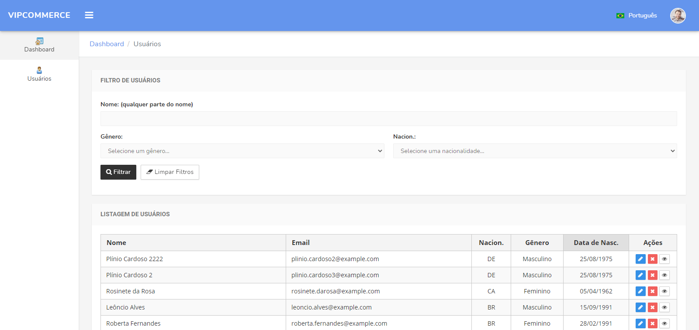

<h4 align="center">
  🚀 Sistema de Usuários - Vipcommerce 
</h4>

<p align="center">
 

  
</p>

<p align="center">
  <a href="#rocket-tecnologias">Tecnologias</a>&nbsp;&nbsp;&nbsp;|&nbsp;&nbsp;&nbsp;
  <a href="#-projeto">Projeto</a>&nbsp;&nbsp;&nbsp;|&nbsp;&nbsp;&nbsp;
  <a href="#-funcionalidades">Funcionalidades</a>&nbsp;&nbsp;&nbsp;|&nbsp;&nbsp;&nbsp;
  <a href="#-requisitos">Requisitos</a>&nbsp;&nbsp;&nbsp;|&nbsp;&nbsp;&nbsp;
  <a href="#-instalação">Instalação</a>&nbsp;&nbsp;&nbsp;|&nbsp;&nbsp;&nbsp;
</p>

<br>

<p align="center">
  
</p>

## :rocket: Tecnologias

Esse projeto foi desenvolvido com as seguintes tecnologias:

- [Angular 9](https://nodejs.org/en/)


## 💻 Projeto

Sistema de Usuários - Vipcommerce é um sistema feito como teste técnico para o processo seletivo de programador fullstack na Vipcommerce


## 💻 Funcionalidades

O sistema possui listagem, edição, visualização e exclusão de usuários com filtros


## 📄 Requisitos

* PHP 7.3+, Laravel 7+, MySQL 5.7+ e Docker


## ⚙️ Instalação e execução

**Windows, OS X & Linux:**

Baixe o arquivo zip e o descompacte ou baixe o projeto para sua máquina através do git clone [https://github.com/randercarlos/vipcommerce-backend.git](https://github.com/randercarlos/vipcommerce-backend.git)


- Entre no prompt de comando e vá até a pasta do projeto:

```sh
cd ir-ate-a-pasta-do-projeto
```

- Crie o arquivo .env a partir do arquivo .env.example. As variáveis de ambiente relacionadas ao banco já estão configuradas.

```sh
copy .env.example .env
```

- Assumindo que tenha o docker instalado na máquina, execute o comando:

```sh
docker-compose up -d
```

- Após os containeres serem criados, será necessário instalar as dependências. Execute o comando:

```sh
docker-compose exec vipcommerce-app composer install
```

- Aguarde até que as dependências do laravel estejam instaladas. 
Após isso, o sistema estará rodando em [http://localhost:8000](http://localhost:8000).

## Endpoints do Sistema

### Usuários

* [Exibe todas os usuários]() : `GET http://localhost:8000/api/v1/users` `Status: 200 Ok`

* [Exibe uma usuário]() : `GET http://localhost:8000/api/v1/users/:id` `Status: 200 Ok OR status: 404 not found`

* [Atualiza um usuário]() : `PUT http://localhost:8000/api/v1/users/:id` `Status: 200 Ok OR status: 404 not found OR status: 422 Unprocessable Entity`

* [Deleta um usuário]() : `DELETE http://localhost:8000/api/v1/users/:id` `Status: 200 Ok OR status: 404 not found OR status: 422 Unprocessable Entity`

Desenvolvido por Rander Carlos :wave: [Linkedin!](https://www.linkedin.com/in/rander-carlos-caetano-freitas-308a63a8/)
